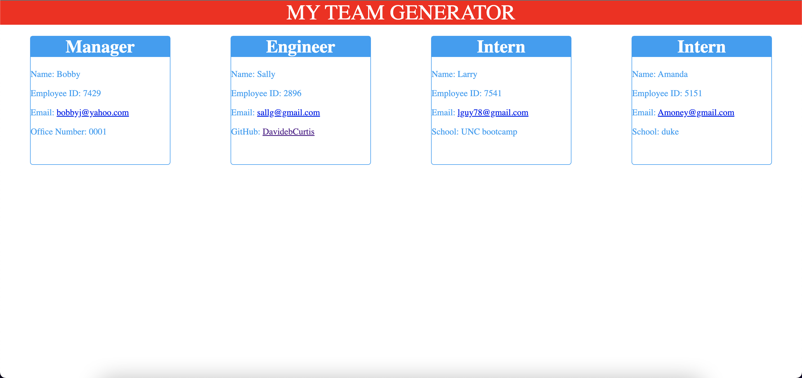

# team-profile-generator

## Description

This application is written to help people create work or prject teams that has teamember information in a clean UI. upon running `node app` You will be prompted to fill out some question to help build your team. After completetion a HTML file is created and placed in the distribution folder for you to use.

### Check out the Demo here

## Table of Contents

[Installation](#installation)
[Usage](#usage)
[License](#license)
[Contributing](#contributing)
[Tests](#tests)
[Questions](#questions)

## Installation

`npm i, npm inquirer`

## Usage

npm i and enter your team information.

## License

This project is licensed under the MIT license

## Contributing

If you want to contribute, you can fork the repo and submit a PR request.

## Tests

To run tests, run the following command:
`npm test`

## Questions

If you have any questions about the repo, open an issue or contact me directly at [heythereimdavidcurtis@gmail.com](mailto:heythereimdavidcurtis@gmail.com). You can find mor of my work at [DavidebCurtis](https://github.com/DavidebCurtis)
